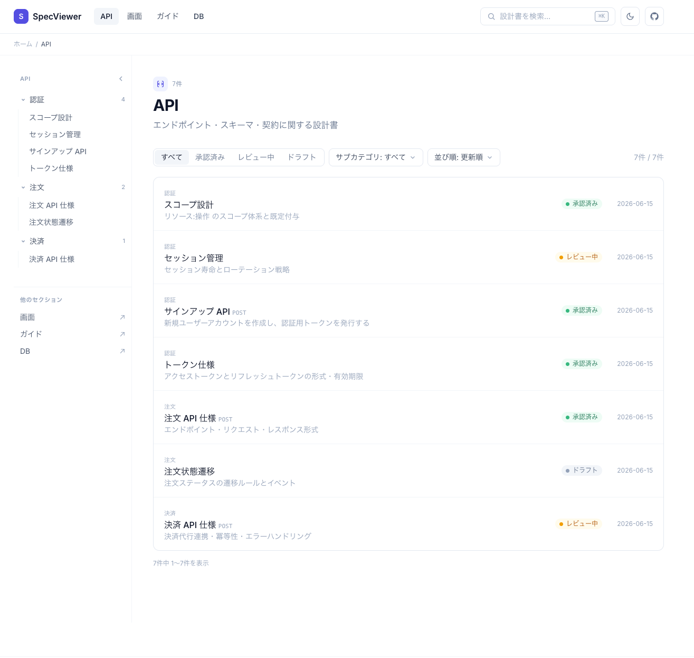
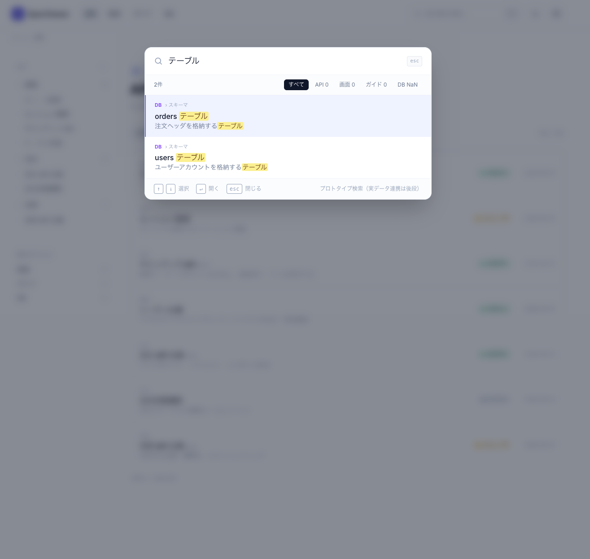
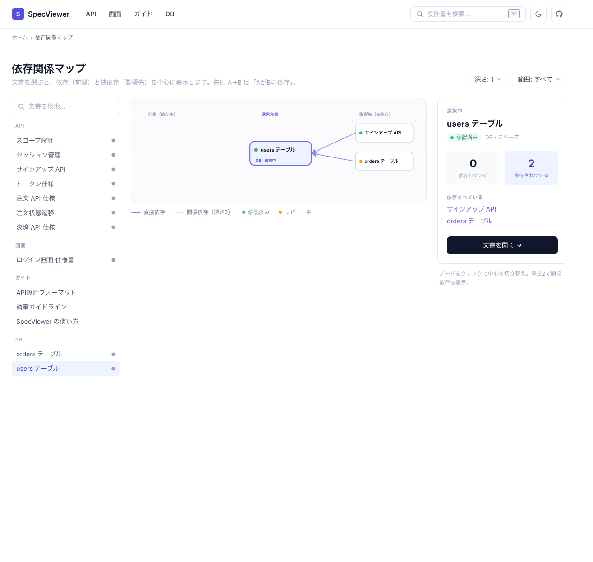

# SpecViewer

設計書（仕様書）を閲覧・検索・ナビゲートするための社内ポータル。
VitePress + Tailwind CSS v4 で構築された**閲覧専用**の静的サイトで、ソースは git で版管理された Markdown です。

> このプロジェクトは読む・探す・ナビゲートするのみを担います。編集・新規作成・承認ワークフロー・権限制御は持ちません（外部の GitHub 等で行います）。

## 特徴

| 機能 | 内容 |
|---|---|
| ホーム | セクションカード（API / 画面 / ガイド / DB）と最近の更新 |
| セクション一覧 | ステータス / サブカテゴリ / 並び順のフィルタ＋文書リスト |
| 詳細 | 本文＋サイドバー（セクションツリー）＋目次＋前後の文書 |
| 検索パレット | `⌘K` / `Ctrl+K` で起動する全文検索（ハイライト・セクション絞り込み） |
| 依存関係マップ | `dependsOn`（前提）と被依存（影響先）をグラフで可視化 |
| ダークモード | ヘッダーのトグルで切替（OS 設定を既定、手動切替は記憶） |

## スクリーンショット

GitHub のテーマ設定（ライト / ダーク）に合わせて画像が切り替わります。

<picture>
  <source media="(prefers-color-scheme: dark)" srcset="images/API-dark.png">
  
</picture>

**API セクション一覧** — フィルタツールバー（ステータス / サブカテゴリ / 並び順）と、サイドバーのセクションツリー、行型の文書リスト。

<picture>
  <source media="(prefers-color-scheme: dark)" srcset="images/search-dark.png">
  
</picture>

**検索パレット**（`⌘K` / `Ctrl+K`） — 部分一致検索、`<mark>` ハイライト、セクション絞り込み、キーボード操作（`↑` `↓` `↵` `esc`）。

<picture>
  <source media="(prefers-color-scheme: dark)" srcset="images/deps-dark.png">
  
</picture>

**依存関係マップ**（`/deps/`） — `dependsOn`（前提）と被依存（影響先）をグラフで可視化。ノードをクリックで中心の文書を切替。

## 技術スタック

| レイヤー | 技術 |
|---|---|
| サイト生成 | VitePress 2.0 |
| スタイリング | Tailwind CSS v4 |
| UI | Vue 3（VitePress 同梱） |
| パッケージ管理 | pnpm 10 |
| 開発環境 | Nix flake（Node.js 24 + pnpm）＋ direnv |

## 必要環境

Nix flake（[flake.nix](flake.nix)）が Node.js 24 と pnpm を提供します。マシンに必要なのは Nix と（推奨）direnv のみです。

- [Nix](https://nixos.org/)（flake サポート付き）
- [direnv](https://direnv.net/)（推奨 — リポジトリに入ると `.envrc` が自動で開発シェルをロード）

> **注意:** pnpm / node は Nix が提供するものを使います。direnv を使わない場合は、以降のコマンドを `nix develop -c` で包んで実行してください。

## クイックスタート

```bash
# 1. リポジトリを取得
git clone <repo-url> spec && cd spec

# 2. 開発シェルに入る（direnv があれば自動。なければ手動で）
nix develop

# 3. 依存関係をインストール（direnv 未使用なら nix develop -c pnpm install）
pnpm install

# 4. 開発サーバーを起動
pnpm docs:dev
```

開發サーバーは http://localhost:5173 などで立ち上がります（表示された URL を開いてください）。

## スクリプト

| コマンド | 内容 |
|---|---|
| `pnpm docs:dev` | 開発サーバー起動（HMR 付き） |
| `pnpm docs:build` | 本番ビルド（`.vitepress/dist/` に出力） |
| `pnpm docs:preview` | ビルド成果物のプレビュー |

## プロジェクト構成

```
.
├── docs/                   # ソース（srcDir）。Markdown がこの下に置かれる
│   ├── index.md            # ホーム（layout: home）
│   ├── api/                # API セクション（docs/api/<subcategory>/*.md）
│   ├── ui/                 # 画面セクション
│   ├── guide/              # ガイドセクション
│   ├── db/                 # DB セクション
│   └── deps/               # 依存関係マップ（/deps/）
├── .vitepress/
│   ├── config.mts          # サイト設定（srcDir / lastUpdated / appearance / fonts）
│   └── theme/              # レイアウト・コンポーネント・データ層
│       ├── docs-data.ts    # docs/*.md を走査して全画面に供給するデータ層
│       ├── Layout.vue      # ルートレイアウト（ヘッダー / サイドバー / 検索）
│       ├── Home.vue        # ホーム
│       ├── SectionList.vue # セクション一覧（4 セクション共通）
│       ├── Doc.vue         # 詳細 / 閲覧
│       ├── Sidebar.vue     # セクションツリー（SectionList / Doc 共有）
│       ├── SearchPalette.vue # 検索パレット（⌘K）
│       └── DepsMap.vue     # 依存関係マップ
├── design-mockups/         # デザイン検討用モックアップ（HTML・参考資料）
├── DESIGN.md               # デザイン仕様・決定事項
└── flake.nix               # 開発環境定義（Node.js 24 + pnpm）
```

## 文書の追加

文書は `docs/{api,ui,guide,db}/<subcategory>/<name>.md` に置くだけです。ビルド時に `docs-data.ts` が frontmatter を走査し、ホーム・一覧・サイドバー・検索・依存マップに**自動で反映**されます。

```yaml
---
title: 注文 API 仕様                # 必須: 文書タイトル
description: エンドポイント・リクエスト・レスポンス形式  # 一覧・OGP で使用
subcategory: 注文                  # 必須: サブカテゴリ（サイドバーの分類）
status: 承認済み                   # 必須: ドラフト | レビュー中 | 承認済み
dependsOn:                         # 任意: 依存している文書（docs/ からの path・.md 無し）
  - api/payment/payment-api
related:                           # 任意: 関連文書（docs/ からの path・.md 無し）
  - api/order/order-state
---
```

ポイント:

- **section** はディレクトリの第1階層から自動判定（`docs/api/` → API）。既存セクションへの追加ならコードを触りません
- **更新日時** は frontmatter に書かず、**git の最終コミット日時**から自動取得します。コミットすれば反映されます
- **`dependsOn` / `related`** は docs/ からの相対 path（`.md` 無し）で指定します。title でなく path なので、title を変えてもリンクが切れません
- 本文の見出し（`##`）は、詳細画面右側の目次（TOC）に自動反映されます

詳しくは以下を参照してください。

## ドキュメント

| 対象 | 資料 |
|---|---|
| デザイン方針・決定事項 | [DESIGN.md](DESIGN.md) |
| 使い方・操作方法（閲覧者 / 設計者） | [docs/guide/usage.md](docs/guide/usage.md) |
| 執筆ガイドライン | [docs/guide/writing.md](docs/guide/writing.md) |
| API 文書の標準フォーマット | [docs/guide/api-format.md](docs/guide/api-format.md) |
| 大カテゴリ（セクション）の追加手順 | [DESIGN.md](DESIGN.md) §14 |

## 開発ノート

- **Tailwind v4:** このプロジェクトでは VitePress 上で Tailwind v4 を使います。クラス文字列は完全な形で記述する必要があります（`.vitepress/theme/docs-data.ts` のセクションメタなど）。スタイル調整は [.vitepress/theme/style.css](.vitepress/theme/style.css) を参照してください。
- **セクション追加:** API / 画面 / ガイド / DB 以外の第5セクションを追加する場合はコード追記が必要です。手順は [DESIGN.md](DESIGN.md) §14「大カテゴリ（セクション）の追加手順」にまとめてあります（`docs-data.ts` と `SectionIcon.vue` の 2 ファイル）。
